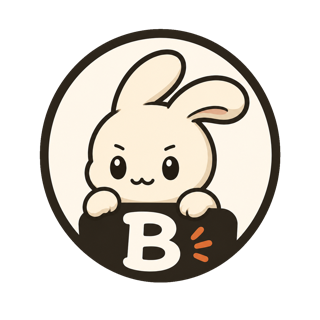

<p align="center">
  <a href="https://benchy.run"></a>
</p>

<h1 align="center">benchy</h1>

<p align="center">
  Benchmark coding agents on the work <b>you</b> actually do.
  <br />
  <a href="https://benchy.run">benchy.run</a> ·
  <a href="https://github.com/option-ai/benchy/releases">releases</a> ·
  <a href="#scoring-the-single-number">scoring</a> ·
  <a href="#architecture">architecture</a>
</p>

<p align="center">
  <a href="https://github.com/option-ai/benchy/releases"></a>
  <a href="LICENSE"></a>
  
</p>

A personal benchmark for coding agents, seeded from your **real** sessions.

```sh
curl -fsSL https://benchy.run/install | sh
```

Installs the latest released binary to `~/.local/bin`. Then run `benchy install`
to set up the skill + capture hooks, and `benchy setup` for agent logins.

Capture the prompts from a Claude Code conversation as an *eval* (with the repo
+ commit you were on). Later, replay those prompts against any installed coding
agent on that exact repo state, and a **blind judge** scores each diff into a
single composite number so you can compare models head-to-head.

```
/add-to-benchy   capture the current session as an eval   (Claude Code skill)
benchy setup     guided setup: install skill, agent logins, pick default judge
benchy run       pick evals × models, run, score (judge from config or --judge)
benchy run --evals a,b --models claude-code:claude-fable-5   # non-interactive
benchy list      list your evals
benchy candidates   list auto-captured candidates awaiting review
benchy candidates promote <name>   move a reviewed candidate into the run set
benchy results   all-time leaderboard, run history, detail, compare two runs
benchy models    show detected agents + the model ids benchy will offer
benchy install   non-interactive: install skill + capture hooks + config
```

## Prospective capture (no skill call needed)

`benchy install` also wires two hooks into `~/.claude/settings.json` so finished
Claude Code sessions become eval candidates automatically — no `/add-to-benchy`
call required:

- **SessionStart** records the commit that was HEAD *before* the work (anchoring
  after the fact is unreliable — this is why prospective capture beats mining old
  transcripts).
- **Stop** parses the finished session, runs it through a **portability filter**,
  and writes passing sessions to a review queue at `~/.config/benchy/candidates/`.

The filter hard-rejects sessions a replay can't reproduce — those using **MCP /
live-data tools** (PostHog, dataforseo, …), **driven by non-portable slash
commands / skills**, depending on a **prior session** ("continue where you left
off"), with **no task prompt**, or that are pure conversational steering.
Multi-task (multi-branch) and no-diff sessions are captured but flagged *weak*
with a warning to split/review them.

**Images.** Screenshots pasted into a session are embedded in the transcript as
bytes — capture extracts them into the eval's `*.assets/` dir, records them in
the `images:` frontmatter, and at replay passes their absolute paths to the
agent (Claude Code reads them with its file tool; the paths sit outside the
worktree so they never pollute the judged diff). A prompt that only *names* an
image path (bytes never stored, temp file gone) can't be recovered — that case
stays a weak warning to inline the detail. Each candidate
records its verdict, score, and warnings inline. Review with `benchy candidates`,
then `benchy candidates promote <name>`. Opt out with `benchy install --no-capture-hooks`.

The capture command never disrupts a session: the `Stop` hook offloads the
transcript parse to a detached worker and returns instantly (parsing a large
session can take ~1s; doing it inline would add that to every turn), a
`SessionEnd` hook forces a final synchronous capture so the last turn is never
missed, and every invocation exits 0 and logs to `~/.config/benchy/capture.log`.

**Auto-promote.** High-scoring captures go straight into the run set
(`snapshots/`), skipping review; the rest wait in the queue. The bar is
`auto_promote_score` in `config.json` — **default `90`** (near-pristine only);
`70` promotes anything rated "good"; `0` disables it so every capture waits for
manual `benchy candidates promote`. Auto-promoted evals are keyed by session id, so a
later turn that drops the session below the bar (or makes it non-portable)
retracts it from the run set automatically.

## Concepts

- **eval** — one captured task: prompts + optional feedback rubric, optionally
  anchored to a repo + commit. One markdown file under
  `~/.config/benchy/snapshots/`. Two flavours:
  - **repo-backed** — replays the prompts against an exact repo state; the judge
    scores the diff.
  - **scratch** — no repo (sessions captured in Claude Desktop, ChatGPT desktop,
    Cowork, or from-scratch tasks). The agent runs in a fresh empty workspace
    and the judge scores whatever it produces — created files and/or its written
    answer.
- **bench** — the set of evals you select for a run (the one thing still called bench).
- **judge** — a model that grades a diff *blind*: it sees the task and the
  feedback rubric, never the model identity or the agent's reasoning.

## Auth

Every supported agent authenticates with **its own login** — benchy stores no
API keys at all. `benchy setup` walks you through it and can launch each login
inline:

| agent        | login                                         |
|--------------|-----------------------------------------------|
| claude-code  | run `claude`, then `/login` (or `claude setup-token`) |
| codex        | `codex login` (your ChatGPT/Codex login, not an API key) |
| cursor-agent | `cursor-agent login`                          |
| opencode     | `opencode auth login`                         |

## Scoring (the single number)

Each `(eval × model)` run collapses to a composite `0–100`:

```
composite = judge_overall × gate_factor
```

- `judge_overall` — rubric-weighted mean of four 0–100 sub-scores:
  task completion (0.40), correctness (0.30), feedback adherence (0.20),
  scope discipline (0.10). Weights live in `~/.config/benchy/config.json`.
- `gate_factor` — starts at 1.0; **build failure caps it at 0.30**, test
  failure ×0.5 (`test_fail_factor`), lint failure −0.10. Clamped to `[0,1]`.
  So a pretty diff that doesn't compile can't beat an ugly one that does.

A model's leaderboard number is the mean composite across the evals it ran.
The config version is stamped into every run so numbers stay comparable.
`benchy results` aggregates every persisted run into an all-time leaderboard,
shows any past run in full (scores, rationales, artifact paths), and
`benchy results compare <a> <b>` diffs two runs model-by-model.

## Rate limits

The agent CLIs don't expose RPM/TPM quotas, so benchy can't query limits — it
defends instead: at most `per_agent_concurrency` (default 2) concurrent jobs
per agent CLI, and failures that look like rate-limiting (429, quota,
overloaded…) get the workspace reset and the job retried with backoff
(30s/90s/180s, `rate_limit_retries` times). A job that stays rate-limited is
reported as `rate-limited (retries exhausted)` rather than a silent 0.

## Replay modes

- `oneshot` (default) — all user messages collapsed into a single prompt.
- `sequential` — each message replayed as its own turn (session resumed for
  agents that support it).

Per-eval `replay:` in the snapshot wins; evals without one use `default_replay`
from config; absent both, oneshot. The `--timeout` flag bounds each agent job's
whole run (all turns).

## Deliverables (`expects`)

Every job captures the full replay transcript (each recorded user turn + the
agent's response; oneshot is the 1-turn case) plus the diff. An optional
per-eval `expects:` tells the judge what to grade:

- `diff` — judge the code change; responses are commentary.
- `answer` — judge the final response; unrequested file edits hurt scope.
- `conversation` — judge behavior across turns (did it push back at the right
  moment, ask the right questions). Forces sequential replay; all four agents
  resume their session between turns.
- absent — the judge infers the deliverable from the task.

User turns are pre-recorded, so the judge is told not to penalize the script
not reacting to the agent; conversation evals test moments, not trajectories.

## Layout

```
~/.config/benchy/
  snapshots/*.md       evals
  snapshots/*.assets/  reference images belonging to an eval (replayed to the agent)
  candidates/*.md      auto-captured evals awaiting review (prospective capture)
  pending/*.json       per-session base-commit sidecars (SessionStart → Stop)
  capture.log          prospective-capture activity / skip reasons
  config.json          scoring weights, defaults, default judge, model overrides
  cache/               cloned repos + model-list caches, reused across runs
  runs/<ts>/run.json   scored results + leaderboard
  runs/<ts>/jobs/      per-job artifacts: diff.patch, output.txt
```

Working trees are created per job and removed once their artifacts are saved —
runs don't accumulate checkouts.

## Architecture

```
cmd/                 cobra CLI: run, list, auth, install
internal/
  config/            on-disk layout, config.json + auth.json, scoring weights
  snapshot/          parse/write eval markdown (YAML frontmatter + prompt blocks)
  adapter/           Agent interface + claude-code/codex/cursor-agent/opencode
  judge/             blind grader: builds the prompt, invokes a model, parses JSON
  score/             composite scoring + leaderboard (unit-tested)
  runner/            orchestration: clone → worktree → agent → diff → gates → judge
  tui/               Bubble Tea selection screens
  skill/             embedded /add-to-benchy SKILL.md
  transcript/        Claude Code JSONL parser + portability filter (prospective capture)
  hook/              installs SessionStart/Stop capture hooks into ~/.claude/settings.json
```

## Judge integrity

The judge sees the task, the rubric, and the work (diff truncated at 80KB,
written answer at 40KB) — never the model identity or the agent transcript. It
runs in an empty directory so a tool-capable judge can't inspect any workspace,
and agent answers are extracted cleanly (codex via `--output-last-message`,
ANSI stripped everywhere) so CLI output formats don't fingerprint the tool.

## Status

Working: capture format (repo-backed + scratch), scoring engine (tested), agent
detection, run orchestration (clone/worktree or scratch workspace, diff, gates,
artifact persistence, cleanup, ctrl+c cancellation), blind judge, leaderboard,
non-interactive runs, guided setup.

Model lists: codex and opencode are read from the tools themselves; claude-code
and cursor-agent are editable defaults. Override any of them via the "models"
map in config.json. Test gates are binary (pass/fail); per-framework pass-ratio
parsing is a future addition.

## Build from source

```
go build -o bin/benchy .
go test ./...
```

## Sandbox the install/usage flow

`script/sandbox.sh` exercises the whole prospective-capture path —
`install` → `SessionStart`/`Stop` hooks → `candidates` → `promote` — in a
throwaway environment that touches nothing on your machine. It overrides `HOME`
(where the skill + hooks install) and `BENCHY_HOME` (where `~/.config/benchy`
lives) to temp dirs, then drives the hooks with synthetic transcripts (including
an embedded image and a session that must be rejected for MCP dependence) and
asserts each step. It stops before `benchy run`, which needs real agent logins.

```
script/sandbox.sh          # run all checks, then clean up
script/sandbox.sh --keep   # leave the sandbox dir for inspection
```

It exits non-zero on the first failed assertion, so it doubles as a CI smoke
test. To sandbox manually, just set the two vars yourself:

```
export HOME=$(mktemp -d) BENCHY_HOME=$(mktemp -d)
go build -o /tmp/benchy . && /tmp/benchy install
```

Prebuilt binaries for macOS and Linux (amd64/arm64) are distributed via
[`benchy.run/install`](https://benchy.run/install) (binaries hosted on R2,
served at `benchy.run/dl/`); `benchy update` pulls the latest from benchy.run.
CI (`go build`/`vet`/`test` + the sandbox smoke test) runs on every PR and push
to `main`.

## Contributing

Issues and PRs welcome. Keep changes small and tested (`go test ./...`);
`internal/score` and `internal/tui` have the strictest coverage — match it for
anything touching scoring or the TUI. For bigger ideas, open an issue first.

## License

[MIT](LICENSE)
